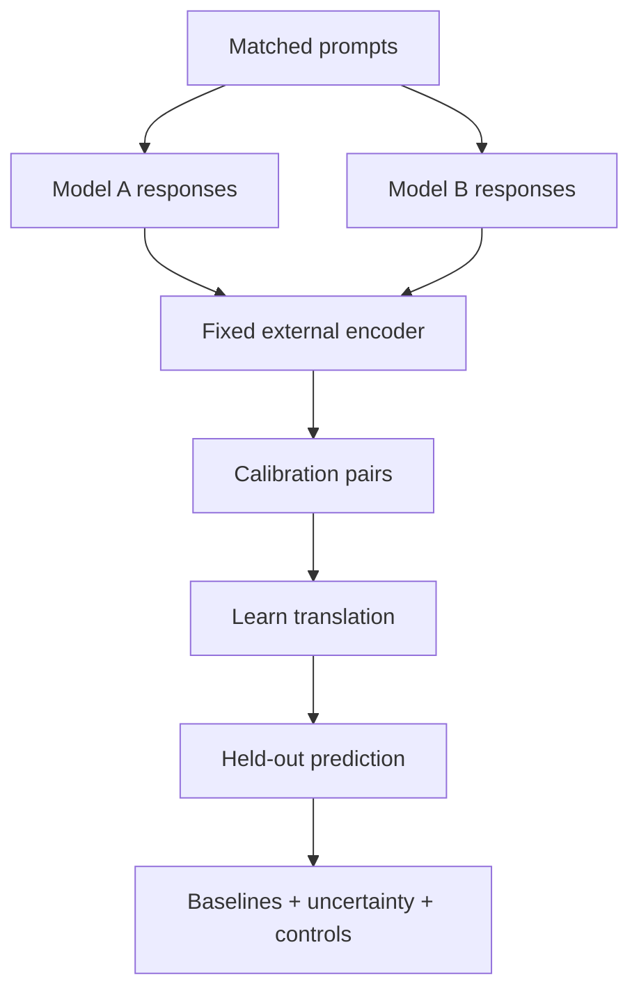

# Vector Tongue

[](https://github.com/RJMpgh/vector-tongue/actions/workflows/ci.yml)
[](https://www.python.org/)
[](#scientific-status)
[](AUTHORS.md)

**A falsifiable, output-only framework for learning and testing the behavioral
translation between AI models.**

**Concept, terminology, and original prototype: RJ Marler.**

Vector Tongue asks a concrete question:

> After observing how Model A and Model B answer a calibration set, can we
> predict Model B's response representation from Model A's response on prompts
> neither model saw during calibration?

Version 2 turns that question into a held-out experiment. It learns translation
operators in a shared external embedding space, evaluates them on unseen
prompts, compares them with simple baselines, estimates uncertainty, and
preserves the original 2025 formulation as a versioned historical artifact.

The repository now includes a
[`preregistered 180-prompt real-model pilot`](experiments/real_models/PREREGISTRATION_PILOT_003.md).
See [`RESULTS.md`](RESULTS.md) for the outcome or the explicit pre-data status.

It does **not** claim access to proprietary model activations, decode an exact
future sentence from an embedding, or prove that a model has a private
language.

## The research object

For prompt \(p\), model \(m\), response \(y_{m,p}\), and a fixed external
encoder \(E\):

\[
z_{m,p}=E(y_{m,p}).
\]

For source model \(A\) and target model \(B\), Vector Tongue learns a map on
calibration prompts:

\[
\hat z_{B,p}=f_{A\rightarrow B}(z_{A,p}).
\]

The primary affine implementation is:

\[
\hat z_{B,p}=z_{A,p}W+b,
\]

with \(W,b\) estimated only from the training split. The claim succeeds only
to the degree that it improves held-out prediction over declared baselines.



## Why this is different from ordinary similarity scoring

Similarity asks whether two known outputs are close. Vector Tongue asks whether
a transformation learned from earlier paired outputs generalizes to new paired
outputs.

The repository separates:

- **description:** cosine distance, Euclidean displacement, norm shift, and the
  historical Marler Drift v1 index;
- **prediction:** held-out cross-model translation error;
- **advantage:** improvement over identity, target-mean, and mean-shift
  baselines;
- **falsification:** shuffled-pair controls and prompt-level uncertainty;
- **provenance:** hashes and external identifiers stored separately from
  scientific results.

## Quick start

```bash
git clone https://github.com/RJMpgh/vector-tongue.git
cd vector-tongue
python -m venv .venv
source .venv/bin/activate
python -m pip install -e .
vector-tongue demo
```

Run the tests:

```bash
python -m unittest discover -s tests -v
```

The demonstration uses synthetic vectors with a known transformation. It
checks the experiment machinery; it is not evidence about real models.

## Run the preregistered real-model pilot

The pilot compares two dated OpenAI model snapshots on 180 frozen prompts,
embeds their responses with one fixed encoder, fits only on 126 calibration
prompts, and evaluates once on 54 held-out prompts.

```bash
python -m pip install -r experiments/real_models/requirements.lock
python -m pip install -e .
vector-tongue experiment validate
vector-tongue experiment batch-submit --acknowledge-api-cost
vector-tongue experiment batch-sync
vector-tongue experiment embed --acknowledge-api-cost
vector-tongue experiment analyze
```

Collection uses OpenAI's asynchronous Batch API and imports results by stable
request ID. The generated report preserves positive, null, and negative results
and records exact artifact hashes. See the
[`experiment runbook`](experiments/real_models/README.md).

## Evaluate real paired embeddings

Prepare a CSV with embeddings created by one fixed encoder:

```csv
prompt_id,category,source_embedding,target_embedding
p001,factual,"[0.12, 0.34, -0.08]","[0.10, 0.30, -0.02]"
p002,reasoning,"[0.07, -0.11, 0.44]","[0.03, -0.04, 0.41]"
```

Then run:

```bash
vector-tongue evaluate paired_embeddings.csv \
  --model ridge \
  --regularization 1.0 \
  --test-fraction 0.25 \
  --output results/evaluation.json
```

For publishable work, freeze prompts and hypotheses first, split by prompt
family where appropriate, retain raw response metadata, repeat generations,
compare encoders, and preregister the primary metric. See the
[research protocol](docs/RESEARCH_PROTOCOL.md).

## Historical v1 and the mathematical correction

The August 5, 2025 public disclosure proposed:

\[
\delta=z_B-z_A,\qquad \hat z_B=z_A+\delta
\]

and:

\[
D_{\text{Marler-v1}}=(1-\cos(z_A,z_B))\lVert z_B-z_A\rVert_2.
\]

Those equations are preserved in [`prototype_v1/`](prototype_v1/) and
[`docs/ORIGINAL_DISCLOSURE.md`](docs/ORIGINAL_DISCLOSURE.md).

Two corrections define v2:

1. A delta calculated from the target being “predicted” reconstructs that
   target by definition. V2 estimates a transformation on calibration prompts
   and evaluates it on unseen prompts.
2. For unit-normalized vectors, cosine distance and Euclidean distance are
   algebraically dependent. V2 reports interpretable components separately and
   retains the product only as the explicitly historical v1 index.

Correcting the prototype strengthens the original research question instead of
retroactively changing its history.

## Vector Tongue as a measurement layer

Vector Tongue can evaluate controlled interventions from other systems. In
[Synthetic Interoception Lab](https://github.com/RJMpgh/synthetic-interoception-lab),
for example:

\[
\text{hardware telemetry}
\rightarrow \text{control intervention}
\rightarrow \text{model output}
\rightarrow \text{Vector Tongue measurement}.
\]

Other plausible uses include:

- model-version regression testing;
- fine-tune and policy-change auditing;
- cross-provider routing diagnostics;
- multi-agent semantic compatibility;
- longitudinal behavior monitoring;
- decomposing systematic translation from prompt-specific residual drift.

These are proposed uses, not validated product claims.

## Scientific status

Implemented and tested:

- safe geometric measures;
- historical Marler Drift v1;
- mean-shift, affine ridge, and orthogonal translation operators;
- truly held-out evaluation;
- three declared baselines;
- prompt-level bootstrap intervals;
- shuffled-pair negative-control machinery;
- a frozen 180-prompt real-model collection pipeline;
- exact model, response, usage, retry, and encoder metadata capture;
- paired-bootstrap intervals for baseline advantage;
- calibration-pair permutation refitting against untouched held-out targets;
- per-family analysis and machine-generated positive/null/negative reporting;
- run manifests binding data artifacts to a code commit;
- deterministic synthetic demonstration;
- provenance-manifest and local hash validation.

Consult [`RESULTS.md`](RESULTS.md) before asserting any empirical advantage.
Until that file contains a completed run, the following remains unestablished:

- predictive advantage on a preregistered real multi-model dataset;
- stability across encoders, prompt families, time, or providers;
- exact response reconstruction;
- correspondence with any model's private latent representation;
- commercial usefulness or legal priority.

The strongest defensible present claim is:

> Vector Tongue is an implemented experimental framework for testing whether
> stable cross-model transformations can predict held-out output embeddings
> better than simple output-only baselines.

## Repository map

```text
src/vector_tongue/     tested v2 research package
prototype_v1/          preserved 2025 proof of concept
tests/                 deterministic unit and integration tests
docs/                  mathematics, protocol, claims, and provenance
provenance/            machine-readable artifact-hash manifest
examples/              input schema and reproducible examples
experiments/            frozen real-model protocol and versioned run artifacts
```

## Authorship and citation

RJ Marler originated the Vector Tongue framework, Output-Only Analysis framing,
terminology, and original prototype. Version 2 was implemented with AI
assistance under RJ Marler's direction. See [`AUTHORS.md`](AUTHORS.md) and
[`CITATION.cff`](CITATION.cff).

## License

Copyright © 2025–2026 RJ Marler. All rights reserved. The source is public for
inspection, reproducibility discussion, and evaluation of the claims; no reuse
license is granted by this repository. See [`LICENSE`](LICENSE). A standard
research or open-source license should be selected with qualified legal advice
before inviting third-party reuse.
